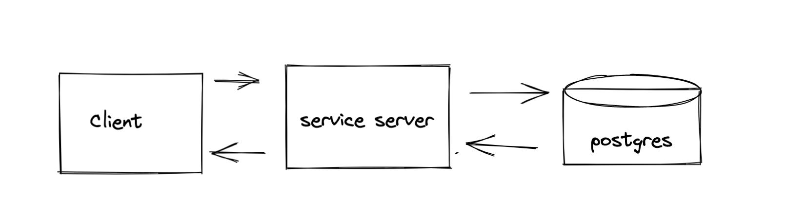
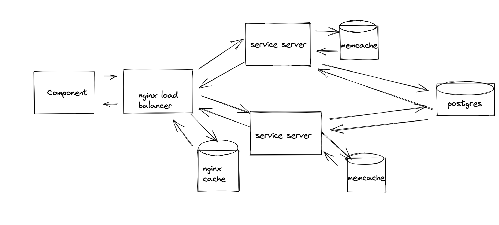

# System Design Capstone Application

## Scaled backend of a front end prototype application to handle 10 million primary records and 80 million secondary records

## Application Specs:

### * GET Request: 600 clients per second, 77 ms per request, 0 % error rate(deployed) (Loader.io testing)
### * Nginx load balancing: least connection (with multiple deployed EC2 instances)
### * Postgres Database
### * CRUD API
### * Deployed using EC2 instances
### * Memcached and Nginx caching


## Initial System Architecture
<a href="url"></a>

<br/><br/><br/><br/><br/>

## Final System Architecture
<a href="url"></a>


<br /> <br /><br /><br /><br /><br /><br /><br /><br /><br /><br /><br /><br /><br /> <br /><br /><br /><br /><br /><br /><br /><br /><br /><br /><br /><br /><br /> <br /><br /><br /><br /><br /><br /><br /><br /><br /><br /><br /><br />

# Front End Capstone Project

## Related Projects

  - https://github.com/Zheng-Yi-Sao/ProductInformation
  - https://github.com/Zheng-Yi-Sao/ProductOverview
  - https://github.com/Zheng-Yi-Sao/CustomerReviews
  - https://github.com/Zheng-Yi-Sao/ProductGallery

## Table of Contents

1. [Usage](#Usage)
1. [Requirements](#requirements)
1. [Development](#development)

## Usage

You will need to create a .env file in the root directory of this project, which link to the server hosting each bundled file for each of the services above -- for example,
```sh
GALLERY_IP='https://productgallery.s3.amazonaws.com'
OVERVIEW_IP='https://productoverview.s3.amazonaws.com'
REVIEW_IP='https://productreviews.s3.amazonaws.com'
INFO_IP='https://productinformation.s3.amazonaws.com'
```

By default, these values will be localhost for testing purposes, meaning you should be able to install all of the related projects running them locally.

Once you create the .env file, you will need to build and then run the service
```sh
npm build
npm start
```


## Requirements

An `nvmrc` file is included if using [nvm](https://github.com/creationix/nvm).

- Node 6.13.0

## Development


### Installing Dependencies

From within the root directory:

```sh
npm install
```
## Deployment
You will need to create an AWS account and have an EC2 instance (or any other similar vps service). If you already are running the Product Gallery service, you can use the same instance for both. I recommend installing pm2 globally to manage them, though it is not necessary --
```sh
npm install pm2
```

Then all you need to do is follow the usage instructions and your proxy will be deployed!

If using pm2, you can then follow the official pm2 startup script documentation.

